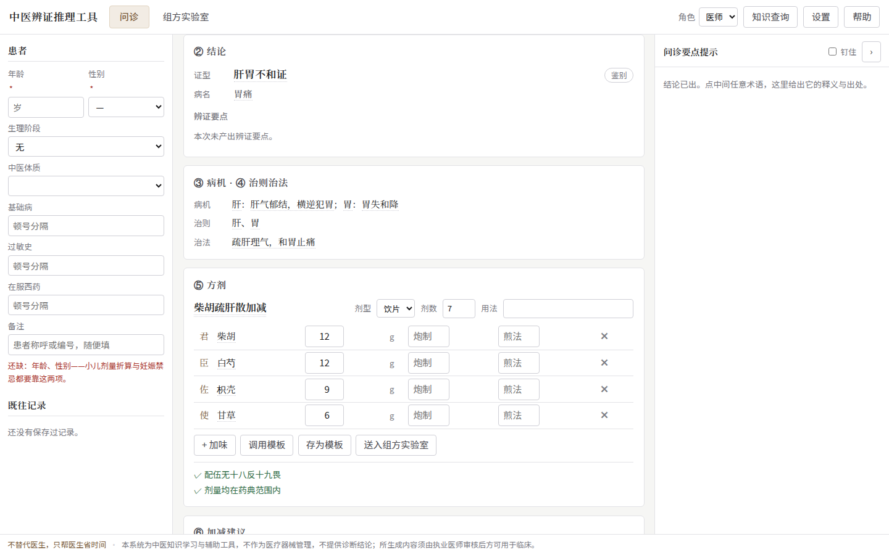
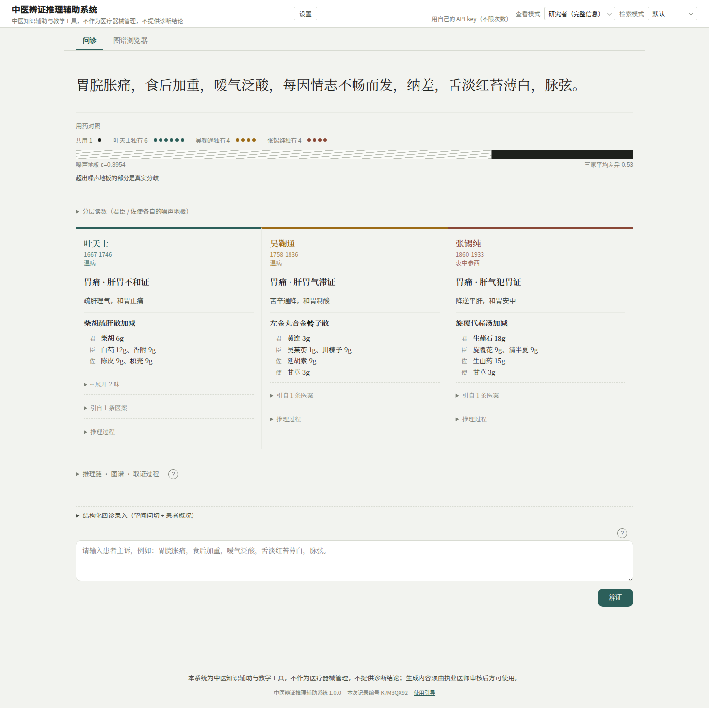
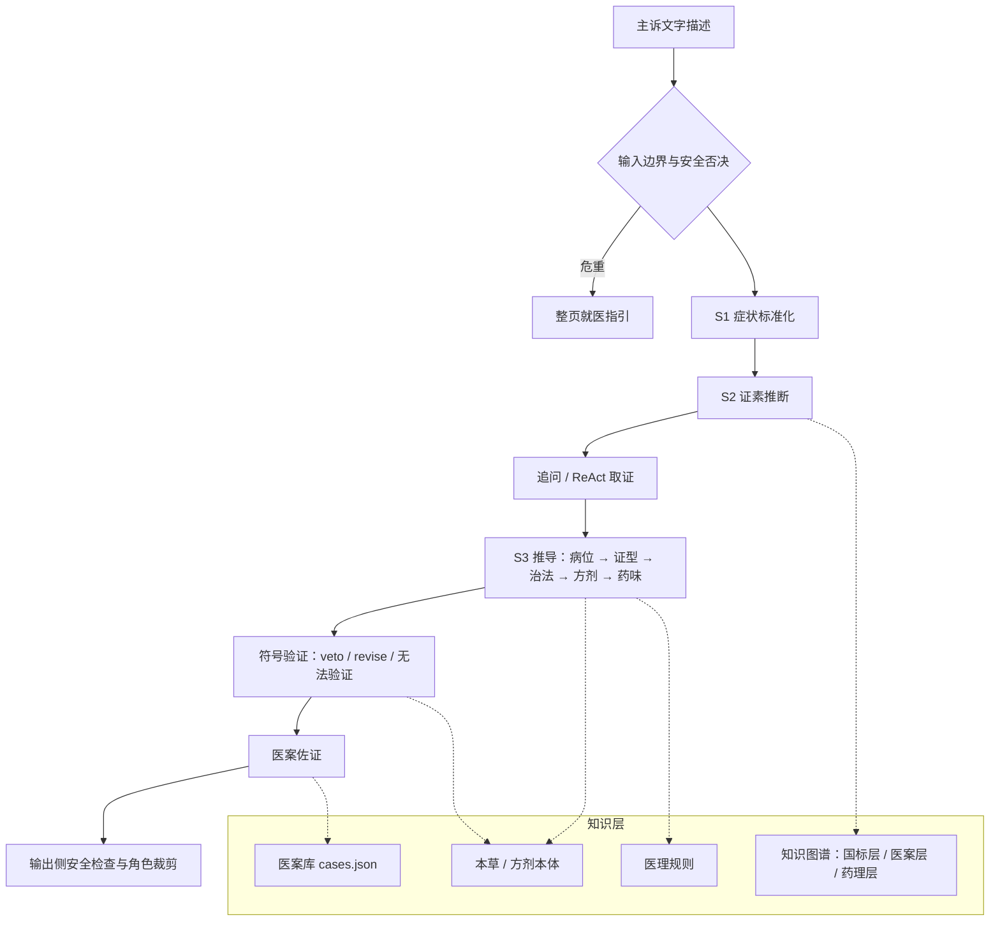

# 名医辨证对照

基于医理规则与本草/方剂本体进行中医辨证推导，用符号验证核对每一条依据，并以叶天士、吴鞠通、
张锡纯三位名医的真实医案作佐证的中医知识辅助系统；研究界面可以把三位医家的辨证并置对比，并用
噪声地板量化其中有多少分歧是真实的。



## 定位与免责声明

本系统是**中医知识辅助与教学、研究工具，不是诊断工具**，不能替代执业医师。界面上的说明文字：

> 中医知识辅助与教学工具，不作为医疗器械管理，不提供诊断结论

医师模式下的说明文字：

> 医师模式：知识辅助工具。系统列出的方剂与剂量出自教材与医案记载，不构成对该患者的用药建议；处方由执业医师审核、修改并签发，医师承担全部临床责任。所有导出操作均记录审计日志。

- **输入边界**：只接受症状、病史与舌象脉象的**文字描述**。舌象照片、脉诊仪信号、检验数值等客观数据
  不在本系统的输入范围内（引入它们会改变产品的监管属性），相关请求返回 HTTP 400。
- **安全否决**：危重症状（如呕血、黑便、剧烈胸痛）在证素推断之前被拦截，不产出任何方药；患者角色
  看到的是整页就医指引。
- **处方安全检查**：十八反十九畏、超剂量、必要煎法在输出侧逐条检查；医师导出处方时服务端重新计算，
  违规导出必须填写理由。
- **审计日志**：导出与处方操作写入哈希链审计日志，可校验篡改。

## 功能特性

- **三相推理链**（默认）：演绎推导（医理规则 + 本草/方剂本体，每一步引用规则或标记依据不足）→
  符号验证（veto / revise 两级规则，无法验证的单独列出）→ 医案佐证（检索各医家医案看有无先例，
  不回头修改推导）。
- **三家集注**（研究模式，`S3_MODE=legacy`）：三位医家各自依据自己的医案辨证开方，三列并列，
  用药对照带同时显示噪声地板 ε 与超出部分。
- **可追溯**：每条结论引用真实的医案 id 或规则/本体原文，引用检索结果之外的 id 会被识别为幻觉引用。
- **检索**：`full_context`（单医家全量医案进提示词，利用前缀缓存，默认）、`dense`、`bm25`、`graph`、
  `hybrid`（BM25 + dense 的 RRF 融合，带 BM25 保底名额）。
- **追问与取证**：按信息增益选择追问的症状；可选的 ReAct 取证（医案层优先）。
- **四种角色**：患者（病名、科室、红旗症状，不含方药）、医师（可编辑处方表、配伍拦截、导出与审计、
  病历文书草稿）、学生（君臣佐使、推理路径高亮）、研究者（完整链路与评测指标）。
- **知识图谱浏览器**：症状 → 证素 → 证型 → 方剂 → 药材的分层图谱，按需展开邻居与分页。
- **医师工作台**：组方实验室、知识查询、结构化四诊录入、教材方剂对照、历史与收藏、处方模板。
- **多种后端**：OpenAI 兼容 API（默认 DeepSeek）、本地 vLLM（支持按医家的 LoRA）、录制回放（零成本、
  可离线、结果可复现）。
- **部署能力**：部署前自检、公开部署的三层访问控制（自带 key / 共享额度 / 用量看板）、提供 HIS 集成接口
  （`X-API-Key` 鉴权）。
- **评测工具**：噪声地板 ε、E2/E3/E4/E8/E9 对照实验、TCMEval-SDT 外部基准、工程开关消融与推理消融、
  MES 盲评导出，评测数字由凭据记号机器核对。



研究界面的用药对照带把三家的共用药与各自独有的药排成点阵，下方的条带中灰色一段是当前主诉的噪声
地板 ε，黑色一段是超出噪声地板的真实分歧。

## 系统架构



五层各自的作用：

| 层 | 作用 | 主要代码 |
|---|---|---|
| 安全层 | 输入侧危重拦截、输出侧配伍/剂量/煎法检查，唯一不可绕过的硬约束 | `core/safety.py`、`core/safety_output.py` |
| ReAct | 多工具取证，医案层优先，让模型决定还缺什么证据 | `core/react.py`、`core/tools.py` |
| 推理链 | S1 → S2 → S3，把结论拆成可追溯的步骤，符号验证与医案佐证 | `core/chain.py`、`core/formula_verifier.py`、`core/corroboration.py` |
| 检索 | 回答"这位医家实际怎么处理" | `core/retrieval*.py`、`core/context_prefix.py` |
| 知识图谱 | 回答"标准怎么规定" | `core/graph/`、`offline/build_graph.py` |

### 一次问诊

1. **输入检查与安全否决**：请求体只接受文字字段；主诉与 S1 标准化后的症状先过危重规则
   （`core/safety.py::check_safety`），命中则整条链中止，不产生证素与方药。
2. **S1 症状标准化**：把口语化的主诉整理成标准症状，每次问诊只运行一次，所有医家共用。
3. **S2 证素推断**：从症状推断病位、病性证素，并据此在证候知识图谱上计算候选证候的后验。
4. **追问**（可选）：信息不足时按信息增益选出最能区分候选证候的症状提问；回答同样先过安全检查。
5. **S3 推导**：按 `S3_MODE` 产出结构化结论。默认的推导模式逐步给出病变脏腑、证型、治法、方剂与
   药味，每一步引用医理规则或本体原文，找不到依据时标记"依据不足"而不是编造。
6. **符号验证**：逐条核对配伍禁忌、剂量、归经覆盖、寒热方向、功效与治法、君臣佐使等；veto 级问题
   阻止下发，revise 级问题连同原文反例回灌给模型修订。
7. **医案佐证**：推导定型后检索医家医案库，报告一致、不一致与无先例三类结果。
8. **输出侧检查与角色裁剪**：十八反十九畏、剂量上限、必要煎法再查一遍；按角色删去不该下发的字段。

所有 LLM 输出都由 pydantic schema 承接，校验失败时把错误回灌给模型重试；提示词在
`prompts/v1/`，用 `string.Template` 渲染。

### 噪声地板

同一条主诉、同一配置下重复推理，同一位医家两次结果之间的用药距离就是**噪声地板 ε**。它按
「主诉 × 医家」逐条估计：可选方剂很少的证型 ε 接近 0，可选方剂很多的证型 ε 明显更高，所以任何
医家之间的分歧都与它自己那条主诉的 ε 配对比较，而不是与全局均值比较。低于噪声地板的"分歧"
不作为医家差异报告。

工程约定见 [`docs/ARCHITECTURE.md`](docs/ARCHITECTURE.md)，界面与产品设计见 [`docs/DESIGN.md`](docs/DESIGN.md)，
具体设计决策见 [`docs/DESIGN_NOTES.md`](docs/DESIGN_NOTES.md)。

## 快速开始

需要 Python 3.11。

```bash
git clone <本仓库地址> tcm && cd tcm
python3.11 -m venv .venv && source .venv/bin/activate
pip install -r requirements.txt

cp .env.example .env              # 填入 LLM_API_KEY（默认使用 DeepSeek 的 OpenAI 兼容接口）
python -m offline.build_graph --all   # 由仓库内的医案与标准证候生成知识图谱与证素索引（零 LLM 调用）

python -m scripts.preflight_deploy --skip-network   # 部署前自检：数据文件、依赖、端口、配置
uvicorn api.main:app --port 8000
```

浏览器打开 <http://localhost:8000>。`./run.sh` 把建环境、装依赖、启动服务串成一条命令。
可以直接粘贴的示例主诉（第三条会触发安全否决）：

```
胃脘胀痛，食后加重，嗳气泛酸，每因情志不畅而发，纳差，舌淡红苔薄白，脉弦。
胸闷胸痛，冷汗
胃脘疼痛数月，近日解黑色柏油样便，头晕心慌，面色苍白，倦怠乏力，舌淡，脉细数。
```

- **录制回放**：`LLM_MODE=replay` 从 `fixtures/` 读取录制好的调用，不需要 key；fixture 需要先用真实
  key 录制（`python -m scripts.record_fixtures`），用法见 [`fixtures/README.md`](fixtures/README.md)。
- **研究界面**：`PRODUCT_MODE=0` 时首页是研究界面（检索方式选择、研究者角色、用量看板等研究面板）；
  再设 `S3_MODE=legacy` 即为三家集注的对比版面。
- **本地模型**：`LLM_MODE=local` 指向 vLLM 服务，见 [`docs/DEPLOYMENT.md`](docs/DEPLOYMENT.md)。

从古籍原文重建医案数据（可选；仓库已带切好的粗段与 `cases.json`）：

```bash
python -m offline.split_cases --books-dir books --stats-only   # 统计，零 LLM 调用
python -m offline.split_cases --books-dir books                # 切出粗段
python -m offline.extract_cases                                # 粗段 → cases.json（需要 LLM）
python -m offline.build_graph --all                            # 建图 → 回写医家权重 → 证素索引
```

`--all` 把三步串在一起；单独运行 `build_graph` 会漏掉权重回写，后验计算会退化为无医家偏好。

## 配置项

所有配置通过环境变量（或 `.env`）给出，完整列表与说明见 [`.env.example`](.env.example)。

| 变量 | 默认 | 说明 |
|---|---|---|
| `LLM_MODE` | `api` | `api` / `local` / `local_inproc` / `replay` |
| `LLM_API_KEY` | — | OpenAI 兼容接口的 key |
| `LLM_BASE_URL` | `https://api.deepseek.com` | 接口地址 |
| `LLM_MODEL` | `deepseek-v4-pro` | 模型名 |
| `S3_MODE` | `derived` | `derived`（三相推导）/ `structured`（综合结论）/ `legacy`（三家各自辨证） |
| `RETRIEVER_MODE` | `full_context` | `full_context` / `dense` / `bm25` / `graph` / `hybrid` |
| `USE_REACT` | 关 | 开启 ReAct 取证 |
| `FAST_MODE` | 关 | 不追问、减少取证步数与采样，响应更快 |
| `PRODUCT_MODE` | `1` | `0` 切换到研究界面 |
| `MAX_CONCURRENT_CONSULTS` | `4` | 同时进行的问诊数上限，满了返回 503 |
| `LLM_MAX_INFLIGHT` | `6` | 进程内同时在途的 LLM 调用数上限 |
| `LLM_TIMEOUT_SECONDS` | 按后端 | 单次调用读超时 |
| `QUOTA_PER_IP_DAILY_CALLS` / `QUOTA_GLOBAL_DAILY_CALLS` | 按调用数折算 | 公开部署的共享额度 |
| `TRUSTED_PROXY_HOPS` | `0` | 受信反向代理层数，0 = 不读 `X-Forwarded-For` |
| `HIS_API_KEYS` | 未设 | HIS 集成接口的 key 列表 |
| `EVAL_MODE` | 关 | 评测专用：安全否决不中止链路。**对外服务不得开启** |

部署、并发、公开访问控制、HIS 集成与故障排查见 [`docs/DEPLOYMENT.md`](docs/DEPLOYMENT.md)。

## HTTP 接口概览

| 方法与路径 | 作用 |
|---|---|
| `GET /health`、`GET /health/live` | 就绪探针（医家注册表、示例主诉、回放状态）与存活探针 |
| `POST /api/consult` | 一次问诊，返回完整结果 |
| `POST /api/consult/stream` | SSE 分步问诊；`POST /api/consult/stream/{stream_id}/answer` 回答追问 |
| `GET /api/graph`、`/api/graph/neighbors`、`/api/graph/search` | 知识图谱浏览（分页、邻居展开、按名查找） |
| `GET /api/node_explain` | 图谱节点释义（零 LLM 调用） |
| `GET /api/reference_cases` | 参考医家的相关医案 |
| `POST /api/prescription/validate`、`POST /api/prescription/export` | 处方校验；处方导出并写审计日志 |
| `POST /api/formula/check`、`POST /api/formula/advise`、`POST /api/compose/verify` | 组方核查与建议 |
| `GET /api/knowledge/search`、`GET /api/classic_formulas`、`GET /api/textbook_formula` | 知识查询 |
| `GET /api/intake/form`、`POST /api/intake/parse` | 结构化四诊录入 |
| `POST /api/emr/draft`、`GET /api/emr/{record_id}` | 病历文书草稿 |
| `GET /api/history`、`/api/records`、`/api/templates`、`/api/preferences` | 历史、记录、模板与偏好 |
| `GET /api/usage`、`POST /api/usage/validate-key` | 剩余额度；自带 key 的预校验 |
| `POST /api/integration/consult`、`GET /api/integration/emr/{record_id}` | HIS 集成接口（`X-API-Key`） |

```bash
curl -s localhost:8000/api/consult -H 'Content-Type: application/json' \
  -d '{"complaint": "胃脘胀痛，食后加重，嗳气泛酸，每因情志不畅而发", "role": "doctor"}'
```

响应字段按角色裁剪：患者角色的响应里没有方剂与药材字段（在服务端构造时跳过），`manifest`
只下发给研究者角色。完整契约见 [`docs/DESIGN.md`](docs/DESIGN.md) §4.7。

## 评测

需要真实 LLM 的评测都在 `eval/` 下，不进 pytest。下表的每个数字旁都有凭据记号 `文件名:键=值`
（文件路径相对 `eval/`），`python -m scripts.collect_results --check` 逐个去文件里取真值核对：

| # | 指标 | 结果 | 对照 | 凭据 |
|---|---|---|---|---|
| 1 | 噪声地板 ε（同一医家重复推理的用药距离，全局均值） | 0.2611 | 其他分歧指标的对照基准 | `epsilon.json:epsilon_online.mean=0.2611` |
| 2 | E3 参考医案换人的改变率 | 0.451 | 闸门 0.4 | `report_e3.json:e3.change_rate=0.451` |
| 3 | E4 去掉参考医案的改变率 | 0.497 | 闸门 0.4 | `report_e4.json:e4.change_rate=0.497` |
| 4 | E9 ReAct 开关的改变率 | 0.463 | 只报出 | `report_e9.json:e9.change_rate=0.463` |
| 5 | TCMEval-SDT Test：chain / baseline（满分 50） | 23.173 / 22.068 | baseline 为同模型、不注入证素分析 | `sdt/test_run_log.jsonl:sdt.chain_last=23.173` `sdt/test_run_log.jsonl:sdt.baseline=22.068` |
| 6 | TCMEval-SDT Test：关闭安全否决 | 27.729 | 与 #5 的差值是安全否决的代价 | `sdt/test_run_log.jsonl:sdt.ignore_safety_veto=27.729` |
| 7 | 幻觉引用（引用了检索结果之外的医案 id） | 27 条引用中 0 条 | 约束生效的证据，不说明模型不会编造 | `report_e3.json:hallucination.n=27` `report_e3.json:hallucination.n_hallucinated=0` |

这些结果由 `deepseek-chat`（ε 与 SDT 的运行记录里写有模型名）在三位医家各自开方（`S3_MODE=legacy`）、
10 条合成测试主诉的配置下产生；实验定义、运行条件、逐条配对的噪声地板与读数说明见
[`eval/RESULTS.md`](eval/RESULTS.md)。常用入口：

```bash
python -m offline.estimate_epsilon --n-repeats 3                              # ε
python -m eval.run_eval --queries-path tests/queries.txt --e3 --e4 --e8 --e9  # 对照实验
python -m eval.sdt.run --sdt-dir $SDT --split Test --solver chain --out out/sdt_chain.txt
python -m scripts.collect_results --check                                     # 核对文档中的数字
```

需要真实 API、GPU 或外部数据的全部作业由 `bash scripts/run_pipeline.sh` 按依赖顺序串联
（`--dry-run` 列出每一步与预估调用数，`--resume` 断点续跑）。

## 测试

```bash
python -m pytest -q      # 离线运行，不需要网络与 API key
ruff check .             # ruff 不在 requirements.txt 里，需要单独安装：pip install ruff
```

测试覆盖推理链的步骤顺序与安全闸门位置、schema 约束、检索融合、符号验证规则、角色裁剪、
录制回放、离线数据管线的确定性、凭据核对，以及前端的纯函数与 DOM 结构。需要真实浏览器的界面状态
由 `python -m scripts.screenshot_states` 用 Playwright 渲染并按 DOM 判据检查，截图输出到
`docs/screenshots/`。

最近一次完整运行：4832 passed, 10 skipped。测试使用假后端与合成数据；需要教材 markdown、
可选依赖（sentence-transformers、vllm、python-docx、playwright）的用例在缺少时自动跳过。前端逻辑
通过 node 加载 `web/*.js` 测试；标记为 `real_embedding` 的用例会加载真实的向量模型。

## 项目结构

```
api/            FastAPI 服务（问诊、SSE、图谱、处方、医师工作台、HIS 集成接口）
core/           推理链、检索、安全层、符号验证、医案佐证、LLM 后端与录制回放
  graph/        知识图谱的存储与构建
offline/        离线数据管线：切分与抽取医案、建图、药理层抽取、训练数据导出
eval/           评测：ε、对照实验、TCMEval-SDT、消融、MES 盲评；RESULTS.md 汇总结果
scripts/        运维与验证脚本：自检、基准、录制回放、结果核对、流水线编排
prompts/v1/     提示词（string.Template 渲染）
web/            前端：研究界面（index.html / app.js / graph.js）与产品界面（product/）
data/           医案粗段、标准证候与本体（data/standard/）、本地语料声明清单
fixtures/       录制回放的 fixture 目录
tests/          pytest 测试
docs/           架构约定、设计、设计说明、部署文档与界面截图
cases.json      结构化医案（941 个诊次，公有领域）
```

## 数据来源与许可

- **医案**：叶天士《临证指南医案》、吴鞠通《吴鞠通医案》、张锡纯《医学衷中参西录》，均为公有领域
  古籍，原文取自 `xiaopangxia/TCM-Ancient-Books`。
- **标准证候与药理层**：人工整理的国标/共识证候，以及从十四五规划教材（`PanckooAI/TCM_Datasets`）、
  《神农本草经》《本草备要》中抽取的三元组；合并了 Apache-2.0 等开源数据集中缺失的条目。
- **版权受限的语料不随仓库分发**：李可、王云启两位医家的现代出版医案需要自行获取，仓库只保留
  声明清单与处理脚本。
- **外部基准**：TCMEval-SDT（CC BY 4.0），需要自行下载。

每一类数据的来源、获取方式、授权与已知问题见 [`data/SOURCES.md`](data/SOURCES.md)。

## 局限性

- **数据不均衡**：三位医家的诊次数差距较大（叶天士 495、吴鞠通 359、张锡纯 87），规模足以验证推理
  管线，不足以支撑关于医家风格的统计结论；三部医案的门类分布也不对齐。
- **幸存者偏差**：古代医案集收录的多是作者认为值得记录的成功案例，不代表真实的诊疗结果分布。
- **术语不对齐**：清代医案的症状与证型表述与现代国标术语体系差异很大，按字面匹配时医案证型几乎
  对不上标准证候，医家层权重（λ1）因此接近 0。
- **只覆盖脾胃门**：医案选取、证候表、安全规则与测试主诉都围绕脾胃门设计。
- **安全层基于关键词与规则**：危重症状识别使用关键词与上下文规则，可能漏判表述不常见的危重情况，
  不能替代临床判断。
- **剂量上限表人工整理**：`core/safety_output.py` 的 `DOSE_LIMITS` 按公开资料整理常用量上限，不是对
  《中国药典》原文的逐字转录；用于临床之前需要对照药典原文复核。
- **本体覆盖有长尾缺口**：古籍特有的药名写法在本草本体中常查不到，相关验证规则记为"无法验证"而不是
  "通过"。
- **评测规模小**：对照实验使用 10 条合成主诉，结论受采样噪声影响（E2 在两次运行中方向相反）。

## License

仓库目前没有附带开源许可证文件。
